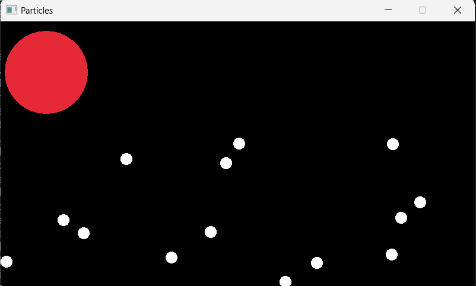

# Molecule World

## what is this?
A particle life simulation that I'm working on.

Currently supports particle collision and reaction.

Base class for particles.

Particles functionality can be expanded.

## How to build project
Currently no implementation, you will need Raylibs.

TODO: add a cmake list